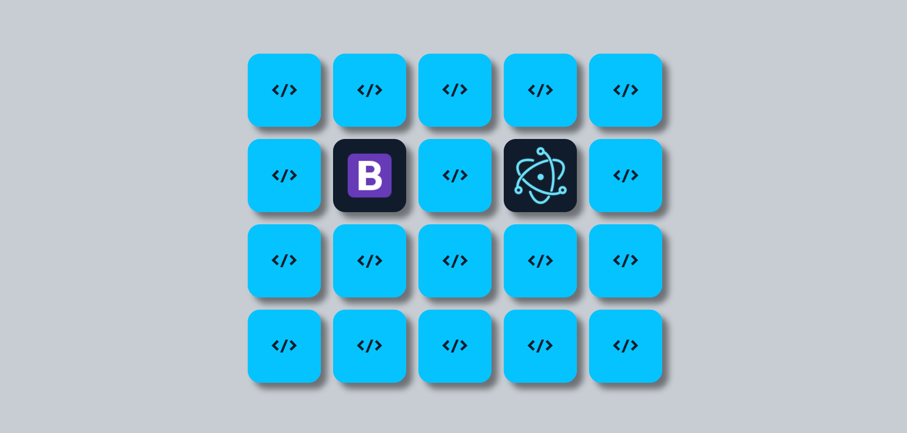
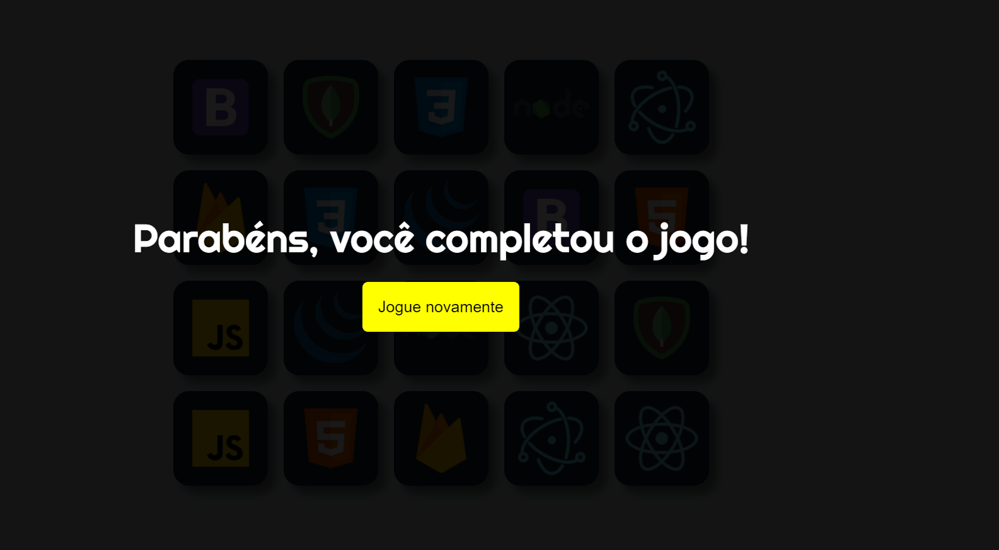

<h1 align="center" >Jogo da Memória </h1>

Desenvolvendo jogo da memória proposto pelo curso do ProgramadorBR, utilizando ReactJs.
<p>Os pares do jogo são os símbolos de algumas tecnologias de desenvolvimento (HTML,CSS,Javascript,Bootstrap,React...).</p>

## Execução do projeto:

Para rodar o projeto, primeiro é necessário clonar o repositório e abrir em uma IDE, VSCode por exemplo.

```bash
# Clonar repositório
$ git clone https://github.com/Edusorrentino10/Jogo-da-Memoria.git

# Acessar pasta do projeto clonado
$ cd Jogo-da-Memoria

# Instalar dependências
$ npm install

# Executar aplicação
$ npm start


# Abrir aplicação na porta 3000, acessando: http://localhost:3000
```

<h2 align="center"></h2>
<h2 align="center"></h2>


Feito por <a href="https://github.com/Edusorrentino10">Eduardo Sorrentino</a>.

Linkedin: https://linkedin.com/in/eduardo-sorrentino/